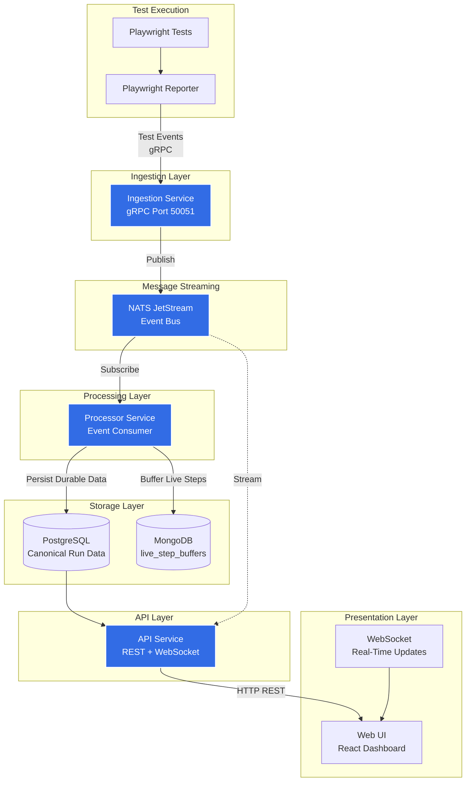

# Observer Architecture

Observer uses an event-driven architecture for test observability. Test events are ingested over gRPC, transported through NATS JetStream, persisted by the processor, and then served by the API and Web UI.

Observer supports two deployment modes:

- **All-in-One (AIO)** for local development and lightweight workflows
- **Distributed** for CI and production environments

## System Overview



## Core Components

### 1. Playwright Reporter (@stanterprise/playwright-reporter)

The Playwright client integration:

- **Purpose**: Captures test execution events and sends them to Observer
- **Protocol**: gRPC (protobuf)
- **Events**: Run, suite, test, step, and attachment lifecycle events
- **Features**:
  - Fire-and-forget async reporting
  - Retry logic with exponential backoff
  - Attachment reporting (screenshots, videos, traces)
  - Sharding support for parallel execution
  - Custom metadata injection via environment variables

**Configuration**:

```typescript
reporter: [
  [
    "@stanterprise/playwright-reporter",
    {
      grpcAddress: "localhost:50051",
      grpcMaxRetries: 3,
      grpcRetryDelay: 100,
      maxAttachmentSize: 10485760,
    },
  ],
];
```

### 2. Ingestion Service

The entry point for all test events:

- **Purpose**: Receives and validates test events via gRPC
- **Port**: 50051 (default, configurable)
- **Protocol**: gRPC (protobuf-based)
- **Scalability**: Stateless, horizontally scalable
- **Features**:
  - High-throughput event ingestion
  - Payload validation
  - Publishes to NATS JetStream

**Key characteristics**:

- Stateless service with no direct durable persistence
- Horizontally scalable
- Validates protobuf payloads before publish

**Environment Variables**:

- `PORT`: gRPC listening port (default: 50051)
- `NATS_URL`: NATS server URL
- `NATS_STREAM`: JetStream stream name (default: tests_events)
- `NATS_SUBJECT_PREFIX`: Subject prefix (default: tests.events.v1)

### 3. NATS JetStream

Message streaming platform for event distribution:

- **Purpose**: Decouples ingestion from processing
- **Features**:
  - At-least-once delivery semantics
  - Durable streams and consumers
  - Stream replay support
- **Benefits**:
  - Reliable event handoff between services
  - Fault tolerance and recovery
  - Multiple consumers (processor and WebSocket relay)

**Configuration**:

```yaml
stream: tests_events
subjects:
  - tests.events.v1.>
retention: workqueue
```

### 4. Processor Service

Event processor that persists test data:

- **Purpose**: Consumes events from NATS and persists durable data to PostgreSQL
- **Pattern**: Durable consumer with idempotent writes
- **Scalability**: Can run multiple instances with consumer groups
- **Features**:
  - Persisted run/suite/test/attempt/attachment records in PostgreSQL
  - Live in-flight step buffering in MongoDB (`live_step_buffers`)
  - Retry and recovery through durable consumer state

**Environment Variables**:

- `POSTGRES_DSN` or `DATABASE_URL`: PostgreSQL connection string (primary persistence)
- `MONGODB_URI`: MongoDB connection string (live-step buffering)
- `NATS_URL`: NATS server URL
- `NATS_STREAM`: JetStream stream name
- `NATS_CONSUMER`: Durable consumer name (default: processor)

### 5. API Service

REST API and WebSocket server:

- **Purpose**: Provides data access and real-time streaming
- **Port**: 8080 (default, configurable)
- **Protocols**: HTTP REST, WebSocket
- **Features**:
  - REST endpoints for listing runs, run details, trends, and marker stats
  - WebSocket endpoint for real-time event streaming
  - PostgreSQL-backed API reads

**Endpoints**:

- `GET /api/tests` - List tests across runs
- `GET /api/tests/{testId}/trends` - Test trends
- `GET /api/runs` - List runs
- `GET /api/runs/{runId}` - Run detail
- `GET /api/runs/stats` - Run statistics
- `GET /ws` - WebSocket connection for real-time events

**WebSocket Events**:

```json
{
  "type": "test.begin|test.end|step.begin|step.end",
  "timestamp": "2026-02-17T03:42:54Z",
  "data": {
    /* event-specific data */
  }
}
```

**Environment Variables**:

- `PORT`: HTTP listening port (default: 8080)
- `POSTGRES_DSN` or `DATABASE_URL`: PostgreSQL connection string (required for REST)
- `NATS_URL`: NATS server URL (optional, for WebSocket)
- `NATS_STREAM`: JetStream stream name
- `NATS_WS_CONSUMER`: WebSocket consumer name (default: websocket)

### 6. Web UI

Modern React-based dashboard:

- **Purpose**: Visualize test runs and monitor execution
- **Technology**: React, TypeScript, Tailwind CSS
- **Port**: 3000 (development), 80 (production/Nginx)
- **Features**:
  - Real-time test execution monitoring
  - Test run listing with status and timing
  - Responsive, mobile-friendly design
  - Environment-based configuration

**Key Views**:

- Test run list with filters
- Test run details with step breakdown
- Real-time execution status
- Failure analysis

## Data Flow

### Test Execution Flow

1. **Test Start**: Playwright test begins execution
2. **Event Capture**: Reporter captures test.begin event
3. **gRPC Send**: Event sent to Ingestion Service via gRPC
4. **Validation**: Ingestion validates protobuf payload
5. **Publish**: Event published to NATS JetStream
6. **Process**: Processor consumes event from NATS
7. **Persist**: Processor saves durable data to PostgreSQL and updates MongoDB live step buffers
8. **Stream**: API service relays event via WebSocket
9. **Display**: Web UI receives WebSocket event and updates UI

### Query Flow

1. **User Request**: User opens Web UI or makes API call
2. **API Call**: Web UI queries API Service
3. **Database Query**: API Service queries PostgreSQL
4. **Response**: Data returned to Web UI
5. **Render**: UI displays test run information

## Deployment Modes

### All-in-One (AIO) Mode

Single container with all services embedded:

**Use Cases**:

- Local development
- CI/CD environments
- Quick demos and testing

**Container**:

```bash
docker run -d \
  -p 3000:80 \
  -p 50051:50051 \
  -p 5432:5432 \
  -v observer-data:/data \
  ghcr.io/stanterprise/observer/aio:latest
```

**Includes**:

- Ingestion service
- NATS JetStream (embedded)
- Processor service
- API service
- PostgreSQL (embedded)
- MongoDB (embedded for live-step buffering)
- Web UI (Nginx)

### Distributed Mode

Separate containers for each service:

**Use Cases**:

- Production deployments
- High-scale test environments
- Multi-tenant setups

**Services**:

- `observer-ingestion`: gRPC ingestion service
- `observer-processor`: Event processor
- `observer-api`: REST/WebSocket API
- `observer-web`: React UI (Nginx)
- `postgres`: Canonical persistence (external)
- `mongodb`: Live-step buffering (external)
- `nats`: Message broker (external)

**Deployment**:

```bash
# Via Helm
helm install observer oci://ghcr.io/stanterprise/observer/charts/observer

# Via Docker Compose
docker compose --profile dist up -d
```

## Next Steps

- [Getting Started](/docs/getting-started/) - Set up Observer
- [Installation](/docs/install/) - Deployment guides
- [Playwright Reporter](/docs/integrations/playwright-reporter/) - Configure the reporter
- [Demo](/docs/demo/) - Try Observer with examples
