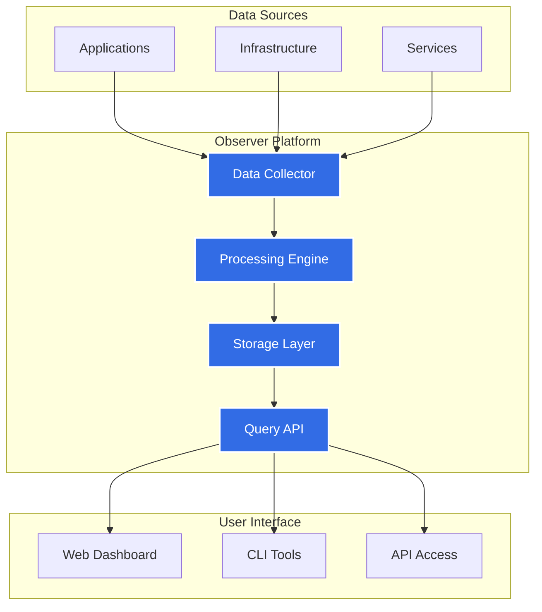


<a class="btn btn-lg btn-primary me-3 mb-4" href="/docs/getting-started/">
  Get Started <i class="fas fa-arrow-alt-circle-right ms-2"></i>
</a>
<a class="btn btn-lg btn-secondary me-3 mb-4" href="https://github.com/stanterprise/stanterprise.github.io">
  GitHub <i class="fab fa-github ms-2 "></i>
</a>

Your comprehensive developer tool for modern observability



{}
Observer empowers development teams with real-time insights into their applications and infrastructure. 
Built for cloud-native environments, Observer provides the visibility you need to understand, debug, and optimize your systems.
{}

{}
{}
Monitor your applications and infrastructure in real-time with powerful dashboards and alerting capabilities.
{}

{}
Designed by developers, for developers. Simple APIs, clear documentation, and intuitive workflows.
{}

{}
Gain deep insights with built-in analytics, tracing, and metrics aggregation capabilities.
{}

{}
Integrate with your existing tools and workflows. Support for Kubernetes, Prometheus, and more.
{}

{}

{}

## Architecture Overview

Observer is built on a modern, cloud-native architecture designed for scalability and reliability.

{}

{}

## Get Started Today

Ready to improve your observability? Get started with Observer in minutes.

<a class="btn btn-lg btn-light me-3 mb-4" href="/docs/getting-started/">
  View Documentation <i class="fas fa-arrow-alt-circle-right ms-2"></i>
</a>

{}
