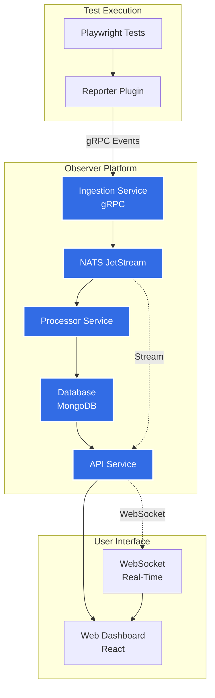


<a class="btn btn-lg btn-primary me-3 mb-4" href="/docs/getting-started/">
  Get Started <i class="fas fa-arrow-alt-circle-right ms-2"></i>
</a>
<a class="btn btn-lg btn-secondary me-3 mb-4" href="https://github.com/stanterprise/stanterprise.github.io">
  GitHub <i class="fab fa-github ms-2 "></i>
</a>

Your comprehensive developer tool for modern observability



{}
Observer is a test observability system that collects test execution events via gRPC, providing real-time insights into your test runs. 
Built for modern CI/CD pipelines, Observer helps teams understand test performance, track failures, and optimize test execution.
{}

{}
{}
Track test execution in real-time with WebSocket streaming and comprehensive dashboards.
{}

{}
Simple gRPC API, Playwright integration, and intuitive web interface for monitoring test runs.
{}

{}
Gain insights into test performance, failure patterns, and execution trends across your CI/CD pipeline.
{}

{}
Works seamlessly with Playwright tests via our custom reporter. Kubernetes and Docker ready.
{}

{}

{}

## Architecture Overview

Observer is built on a modern, event-driven architecture designed for scalability and real-time test monitoring.

{}

{}

## Get Started Today

Ready to improve your observability? Get started with Observer in minutes.

<a class="btn btn-lg btn-light me-3 mb-4" href="/docs/getting-started/">
  View Documentation <i class="fas fa-arrow-alt-circle-right ms-2"></i>
</a>

{}
