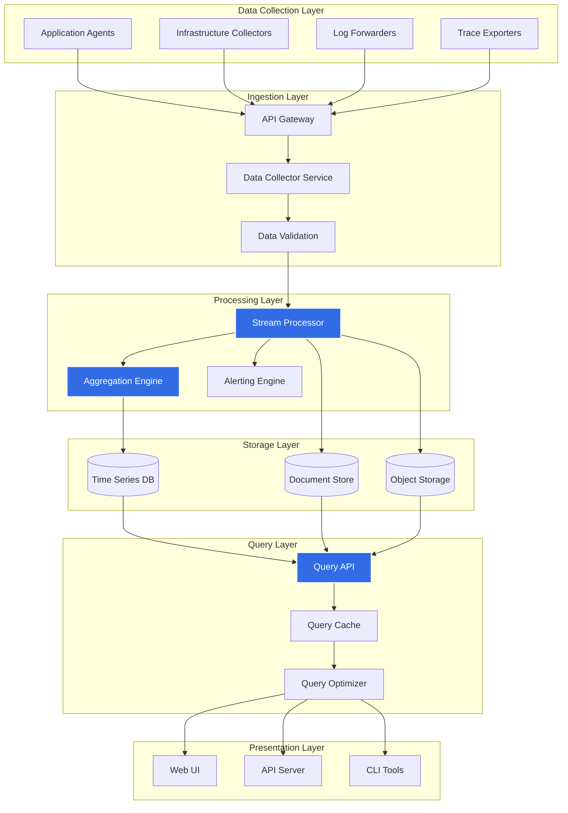

# Observer Architecture

Observer is built on a modern, cloud-native architecture designed for scalability, reliability, and ease of use.

## System Overview

## Core Components

### 1. Data Collection Layer

The data collection layer gathers observability data from various sources:

- **Application Agents**: Embedded agents that collect application metrics and traces
- **Infrastructure Collectors**: Gather system-level metrics (CPU, memory, disk, network)
- **Log Forwarders**: Collect and forward application and system logs
- **Trace Exporters**: OpenTelemetry-compatible trace collection

### 2. Ingestion Layer

The ingestion layer receives and validates incoming data:

- **API Gateway**: Entry point for all data ingestion with rate limiting and authentication
- **Data Collector Service**: Handles high-throughput data ingestion
- **Data Validation**: Ensures data quality and schema compliance

### 3. Processing Layer

The processing layer transforms and enriches data:

- **Stream Processor**: Real-time data processing using event streaming
- **Aggregation Engine**: Pre-aggregates metrics for faster queries
- **Alerting Engine**: Evaluates alert rules and triggers notifications

### 4. Storage Layer

The storage layer persists data with optimized storage strategies:

- **Time Series Database**: Efficient storage for metrics (Prometheus-compatible)
- **Document Store**: Structured logs and metadata
- **Object Storage**: Long-term retention of raw data and traces

### 5. Query Layer

The query layer provides efficient data access:

- **Query API**: RESTful and GraphQL APIs for data access
- **Query Cache**: In-memory caching for frequently accessed data
- **Query Optimizer**: Optimizes query execution plans

### 6. Presentation Layer

The presentation layer provides user interfaces:

- **Web UI**: Interactive dashboards and visualization
- **API Server**: RESTful API for programmatic access
- **CLI Tools**: Command-line interface for automation

## Data Flow

1. **Collection**: Agents and collectors send data to the API Gateway
2. **Ingestion**: Gateway routes data to the Data Collector Service
3. **Validation**: Data is validated and enriched with metadata
4. **Processing**: Stream Processor handles real-time processing and aggregation
5. **Storage**: Processed data is stored in appropriate databases
6. **Querying**: Users query data through the Query API
7. **Presentation**: Results are displayed in the Web UI or returned via API

## Scalability

Observer is designed to scale horizontally:

- **Stateless Services**: All services are stateless and can be scaled independently
- **Distributed Processing**: Stream processing distributes load across multiple workers
- **Sharded Storage**: Data is automatically sharded across storage nodes
- **Load Balancing**: Built-in load balancing for high availability

## High Availability

Observer ensures high availability through:

- **Redundancy**: Multiple replicas of each service
- **Health Checks**: Automatic health monitoring and failover
- **Data Replication**: Synchronous and asynchronous replication
- **Graceful Degradation**: Continues operation with reduced functionality if components fail

## Security

Security is built into every layer:

- **Authentication**: OAuth2, OIDC, and API key authentication
- **Authorization**: Role-based access control (RBAC)
- **Encryption**: TLS for data in transit, encryption at rest
- **Audit Logging**: Comprehensive audit logs for all operations

## Performance Characteristics

- **Ingestion Rate**: Up to 1M+ events per second per collector node
- **Query Latency**: Sub-second queries for recent data
- **Storage Efficiency**: 10:1 compression ratio for metrics
- **Retention**: Configurable retention policies (default: 30 days for metrics)

## Technology Stack

- **Runtime**: Go for core services, React for Web UI
- **Storage**: PostgreSQL, TimescaleDB, S3-compatible object storage
- **Messaging**: Apache Kafka for event streaming
- **Caching**: Redis for query caching
- **Orchestration**: Kubernetes-native deployment

## Next Steps

- [Getting Started](/docs/getting-started/) - Set up Observer
- [Installation](/docs/install/) - Detailed installation guide
- [Integrations](/docs/integrations/) - Connect Observer to your stack
- [Demo](/docs/demo/) - Try Observer with sample data
